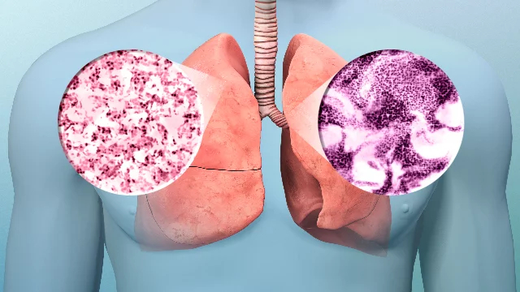

# Deep Learning Networks Comparison of Histologic Patterns on Resected Lung Adenocarcinoma Slides

This repository contains the code for the project article prepared for the ARI5004 (Deep Learning) course at Bahçeşehir University. 

NeurIPS styled report: [Deep Learning Networks Comparison of Histologic Patterns on Resected Lung
Adenocarcinoma Slides](https://drive.google.com/file/d/1fs-4PK2iSX_sbzeuIlnXxy6YzBW0D-fZ/view?usp=sharing).

<p align="center">

</p>

## Requirements

Python packages required (can be installed via pip or conda):

``` 
 - torchvision
 - tqdm
 - numpy
 - pandas
 - matplotlib
 - scikit-learn
 - seaborn
 - pillow
```

## Data Preparation

First of all, gather a dataset according to the specified format:

```
Data
    │
    └── val
          ├── <classname1>
                          │ 
                          ├── <img1>
                          ├── <img2>
                          └── ...
          ├── <classname2>  
          └── ...    
      
```

## Hyperparameters

### In the Preprocess.py file:
``` python
df_classes = df_classes.iloc[:4000]
```
This line is added to fix the data imbalance between classes. 
Change for personal wishes or put a comment character(#) on the beginning to disable it.

### Adjusting Model Parameters in the Properties.py

```python
BATCH_SIZE = 1
NUM_WORKERS = 24
EPOCHS = 10
LR = 0.00008  # Learning Rate
WD = 0  # Weight Decay
GAMMA = 0.9
SAVE_MODEL = True
IMAGE_SIZE = 228
TRAIN = True  # Change to False to analyse model(s) by some metrics
NUM_CLASSES = 5  # Amount of classes to classify in the model according to the dataset
```

## Training

To train the model(s) in the paper, run this command:

```train
python train.py --input-data <path_to_data> --alpha 10 --beta 20
```

>📋  Describe how to train the models, with example commands on how to train the models in your paper, including the full training procedure and appropriate hyperparameters.

## Evaluation

To evaluate my model on ImageNet, run:

```eval
python eval.py --model-file mymodel.pth --benchmark imagenet
```

>📋  Describe how to evaluate the trained models on benchmarks reported in the paper, give commands that produce the results (section below).

## Pre-trained Models

You can download pretrained models here:

- [My awesome model](https://drive.google.com/mymodel.pth) trained on ImageNet using parameters x,y,z. 

>📋  Give a link to where/how the pretrained models can be downloaded and how they were trained (if applicable).  Alternatively you can have an additional column in your results table with a link to the models.

## Results

Our models achieve the following performances on :


| Model name | Accuracy | Precision | Recall | F1  |
|------------|----------|-----------|--------|-----|
| CNN        | 85%      | 95%       | 95%    | 95% |
| ResNet     | 85%      | 95%       | 95%    | 95% |
| DenseNet   | 85%      | 95%       | 95%    | 95% |


## Known Issues and Limitations

```
 - Only 1 GPU is supported
 - The dataset used in this study was not presented.
```

## Contributing

Dataset and idea is borrowed from [Deepslide](https://github.com/BMIRDS/deepslide), Thanks for their excellent work!
